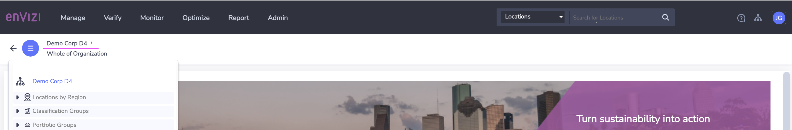

# Envizi Integration Hub - Prepare Configuration file

This document explains about how to prepare Configuration file to use in Envizi Integration Hub.

## 1. Download the Config file

1. Download the [envizi-config-sample.json](../config/envizi-config-sample.json)
2. Rename it to `envizi-config.json`

## 2. Update Envizi s3 bucket details

Update the below envizi s3 bucket details from the data we noted while creating Data service in envizi.

```
  "envizi": {
    "access": {
      "bucket_name": "envizi-client-dataservice-us-prod",
      "folder_name": "client_9608cd600af647",
      "access_key": "xxxx",
      "secret_key": "xxxxx"
    },
  }
```

  "envizi": {
    "access": {
      "bucket_name": "envizi-client-dataservice-us-prod",
      "folder_name": "client_dedd4566f2f247",
      "access_key": "xxxx",
      "secret_key": "xxxx"
    },
    "parameters": {
      "org_name": "IBM APAC",
      "org_link": 17000104,
      "prefix": "G5"
    }
  },


## 3. Update Envizi OrgName

Update `org_name` in `envizi` section.

The Org Name is your organization name in the org hierarchy.
```
  "envizi": {
    "parameters": {
      "org_name": "IBM APAC",
      "org_link": 17000104,
    }
  },
```


## 4. Update Envizi Prefix (Optional)

Update `prefix` in `envizi` section.

This helps to create all the groups, locations and accounts created by this integration hub prefixed to avoid duplicates if any.
```
  "envizi": {
    "parameters": {
      "prefix": "G5"
    }
  },
```

## 5. Update Turbonomic access

Update the below Turbonomic access details.

The user should have `Observer` role.

```
  "turbo": {
    "access": {
      "url": "https://xxxxx.turbonomic.com",
      "user": "",
      "password": ""
    },
  }

```
## 6. Update Turbonomic parameters (Optional)

Here are the Turbonomic parameters.

```
  "turbo": {
    "parameters": {
      "group": "Sustainable-IT",
      "sub_group": "Turbonomic",
      "start_date": "2023-10-30",
      "end_date": "2023-11-04"
    },
    }
```

1. The `group` and `sub_group` are created as `Groups` in Organization Hierarchy.
2. Each datacenter from Turbonomic is created as a `Location` under the `sub_group`.


## 7. Update Turbonomic Account Styles

The below Account Styles should be available for the Turbonomic integration. If you don't have them, then you can create them using `Account Style Wizard` in Envizi.

  ```
  Energy Consumption - kWh
  Active Hosts [Number]     
  Active Virtual Machines [Number]
  Energy Host Intensity - kWh/host
  Virtual Machine to Host Density - VM/Host
  ```

Here are the properties related to Account Styles. 

1. Account style name is given in the `caption` field. If this account style exists in your instance then leave it as it is. If it doesn't  exists then either you find the equivlanet Account style and update the `caption` field, otherwise, create new account style and the `caption` field. 

2. Update the columns field to columns that you have created for the each account style.

```
  "turbo": {
    "account_styles" : [
      {
        "name": "energy_consumption",
        "link": 14445,
        "account_name": "Energy Consumption", 
        "caption": "S2 - Electricity - kWh", 
        "columns" : ["Total Electricity (kWh)", "Green Power (kWh)", "Total Cost"],
        "file_prefix" : "Account_Setup_and_Data_Load_engery_"
      },
      {
        "name": "active_hosts",
        "link": 17000021,
        "account_name": "Active Hosts", 
        "caption": "Active Host",
        "columns" : ["Active Hosts (Number)"],
        "file_prefix" : "Account_Setup_and_Data_Load_host_"
      },
      {
        "name": "active_vms",
        "link": 17000027,
        "account_name": "Active VMs", 
        "caption": "Active Virtual Machines",
        "columns" : ["Active Virtual Machines (Number)"],
        "file_prefix" : "Account_Setup_and_Data_Load_vm_"
      },
      {
        "name": "energy_host_intensity",
        "link": 17000025,
        "account_name": "Energy Host Intensity", 
        "caption": "Energy Host Intensity - kWh/host",
        "columns" : ["Energy per host (kWh/Host)"],
        "file_prefix" : "Account_Setup_and_Data_Load_engeryhost_"
      },
      {
        "name": "vm_host_density",
        "link": 17000026,
        "account_name": "VM Host Density", 
        "caption": "Virtual Machine to Host Density - VM/Host",
        "columns" : ["Virtual Machine to Host Density (VM/Host)"],
        "file_prefix" : "Account_Setup_and_Data_Load_vmhost_"
      }
    ]
```

If you configure the account style names properly then for each Datacenter from Turbonomic, the below `Accounts` and `Account Styles` will be created.
  ```
  Account                         Account Style
  -----------------------         ------------------------
  Energy Consumption      ---     Energy Consumption - kWh
  Active Hosts            ---     Active Hosts [Number]     
  Active VMs              ---     Active Virtual Machines [Number]
  Energy Host Intensity   ---     Energy Host Intensity - kWh/host
  VM Host Density         ---     Virtual Machine to Host Density - VM/Host
  ```
