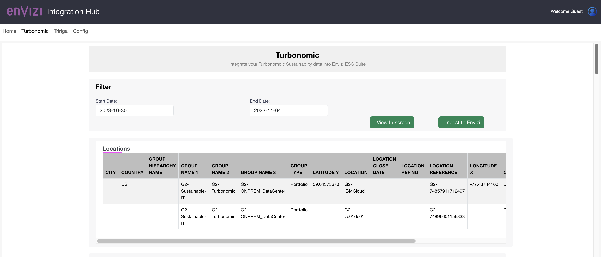
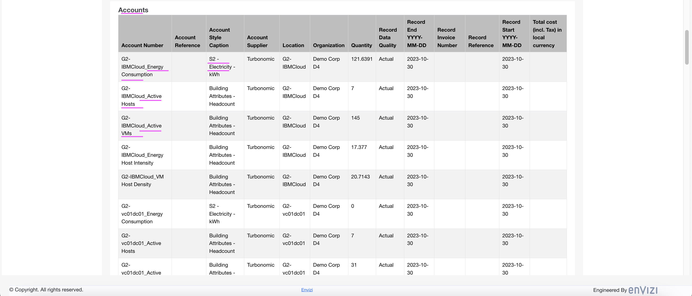
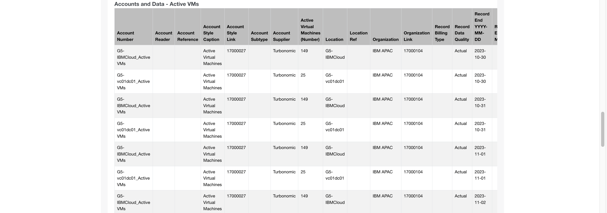
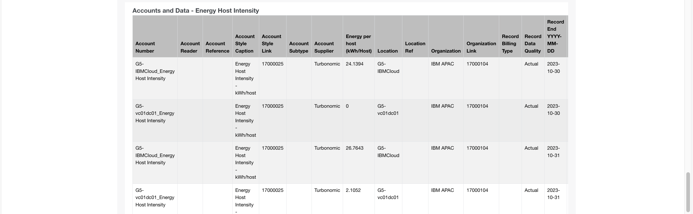
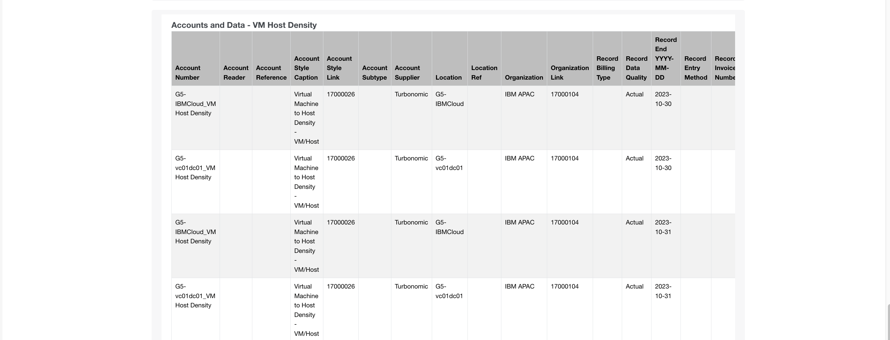

# Envizi Integration Hub - Ingest Turbonomic Data into Envizi via the App

Lets ingest data from Turbonomic into Envizi.

1. Click on the `Turbonomic` menu and get into Turbonomic integration screen.

2. Enter the `Start Date` and `End Date` for the period to which we need to pull Turbonomic data.

3. Click on the  `Ingest to Envizi` button to kick start the Ingestion process.

4. You can see the `locations` and `accounts` data pulled by this Integration Hub in the screen. At the same time  the data might have been pushed to S3 for the integration with Envizi.

