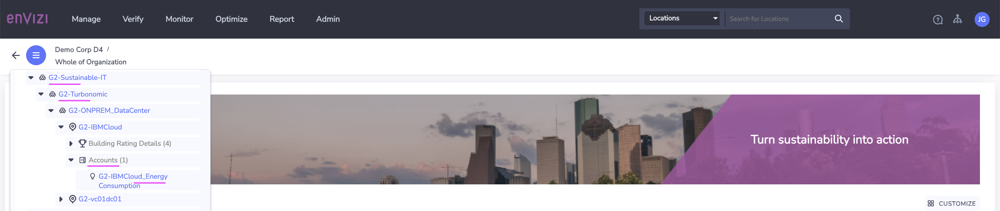
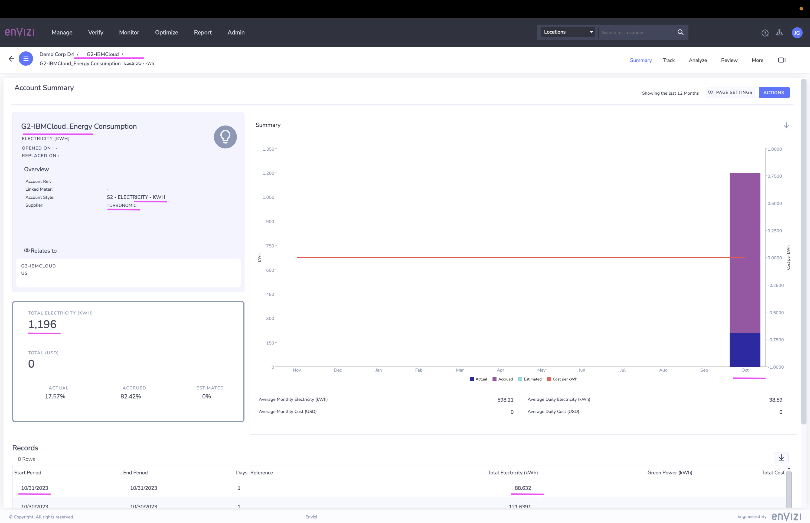

# Envizi Integration Hub - View the Turbonomic Data in Envizi

Lets view the Turbonomic Data in Envizi now.

### 1 View File Delivery Status

View the `file delivery status` to see the `locations` and `accounts` related files are integrated into Envizi.

### 2 View Org Hierarchy

View the `Org Hierarchy` to see the `groups`, `locations` and `accounts` are created in Envizi.

Here `Energy Consumption` related account is available.

Here the other accounts `Active Hosts`, `Active VMs` and etc are available.

### 3 View Summary page

View the summary page to see the account details.

