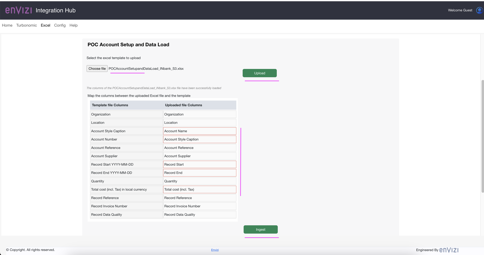
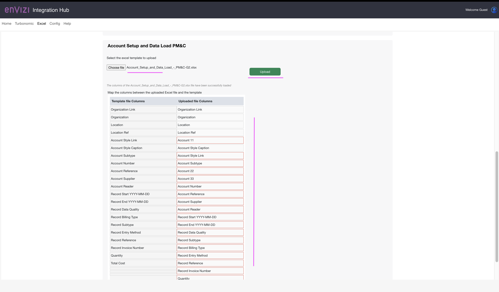

# Envizi Integration Hub - Excel Template Processing.

When you have your data in the excel you can use this module to push the data to Envizi.

### 1 Config Connector & UDC Template

If you have the Config Connector & UDC Template files in the expected format, you can directly upload those file in this section and upon Ingest button click it will be pushed to S3 bucket configured in the Data Services to integrate the data into the Envizi.

### 2 POC Account Setup and Data Load

If you have something similar to POC Account Setup and Data Load format you can upload the file in this section. It shows the template file columns on the left and the uploaded files column on the right. You can drag and drop the columns appropriately and click ingest to push the files to S3 bucket for further processing.

### 3 Account Setup and Data Load PM&C

If you have something similar to Account Setup and Data Load PM&C format you can upload the file in this section. It shows the template file columns on the left and the uploaded files column on the right. You can drag and drop the columns appropriately and click ingest to push the files to S3 bucket for further processing.

