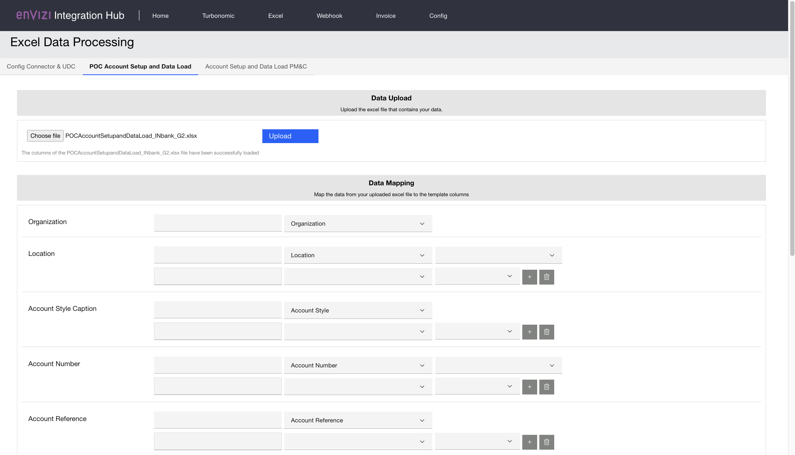
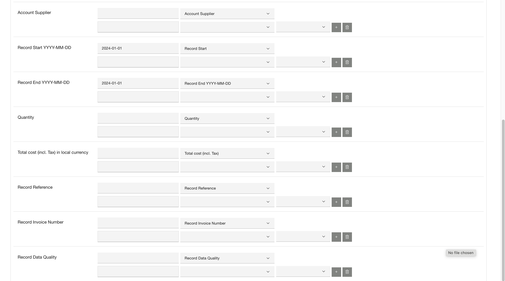
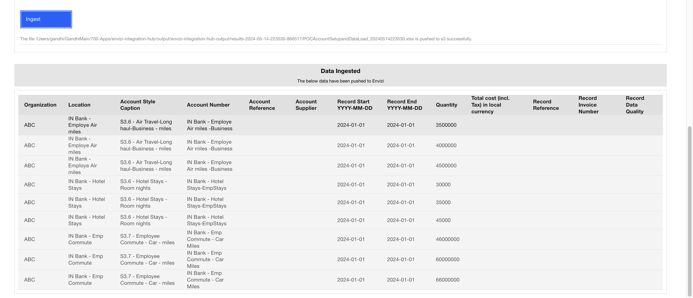
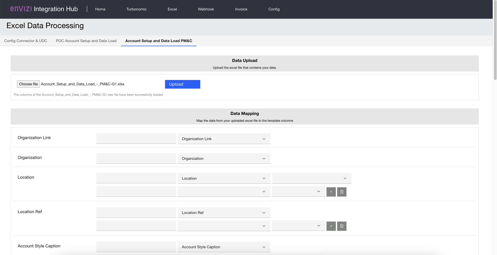
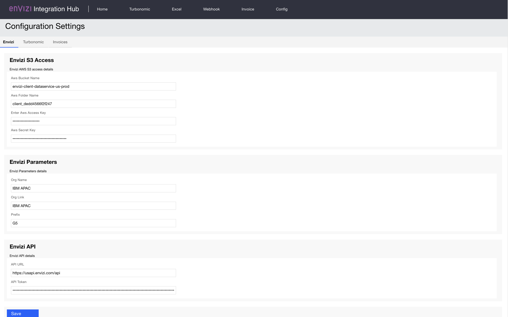

# Envizi Integration Hub - Excel Data Processing.

The ESG data in excel file can be integrated into Envizi using this Integration Hub.

### 1 Config Connector & UDC Template

The excel files with the Envizi format such as `Config Connector template`, `UDC templates` and  `Contact connector template` can be directly uploaded into Envizi S3 Bucket from this section.

### 2 POC Account Setup and Data Load

The `POC Account Setup and Data Load` template can be created using this section and pushed to Envizi via S3 bucket.

### 3 Account Setup and Data Load PM&C

The `Account Setup and Data Load PM&C` template can be created using this section and pushed to Envizi via S3 bucket.

### 4 Configuration

The configurations related to `S3 bucket` can be done here.

