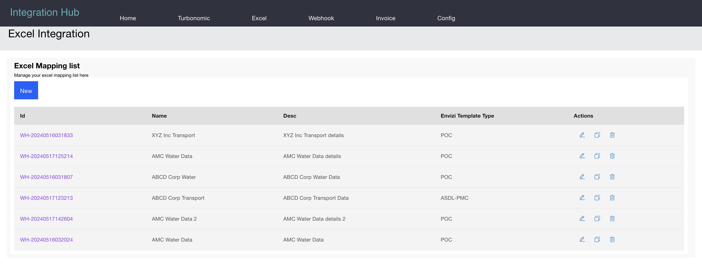
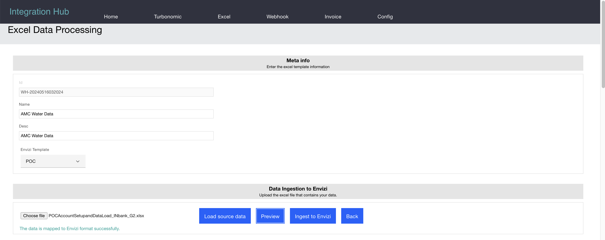
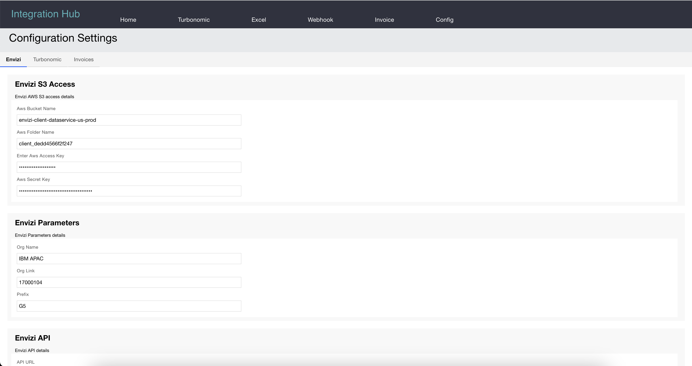

# Envizi Integration Hub - Excel Data Processing

The ESG data in excel file can be integrated into Envizi using this Integration Hub.

## 1. Architecture

Here is the architecture of the Hub.

## 2. Excel Mapping List

Here is the list of available Excel Mappings and it can be opened and executed. 

The new, open, clone and delete operations are available from here.

## 3. Excel Mapping Edit

Here is detailed info about a Excel Mapping.

The Excel Mapping edit contains the following sections.

1. Meta Info : Name, description and type of the template.
2. Data Ingestion to Envizi : To upload your source esg data file to do mapping and ingest into Envizi.
3. Data Generated : Before you ingest the data into Envizi (by tranforming the upload excel into Envizi format based on the given mapping) you can view the geneated data here.
4. Validation Errors : If any validation error found during the convertion process then they are highlighted here.
5. Data Mapping : Actual Data mapping between the uploaded excel and Envizi Data format can be done here.

## 4. Mapping

TODO: But you can refer the mapping <a href="../11-webhook">here</a> for now.

## 5. Configuration

The S3 configuration related to this is available here.

