# Envizi Integration Hub - WebHook

You can integrate any external systems exposing APIs and returning data in JSON format into Envizi using the Webhook. The external system can be an ERP, SAP and etc.

## 1. Architecture

Here is the architecture of the Hub.

## 2. Webhooks List

Here is the list of available webhooks and it can be opened and executed. 

The new, open, clone and delete operations are available from here.

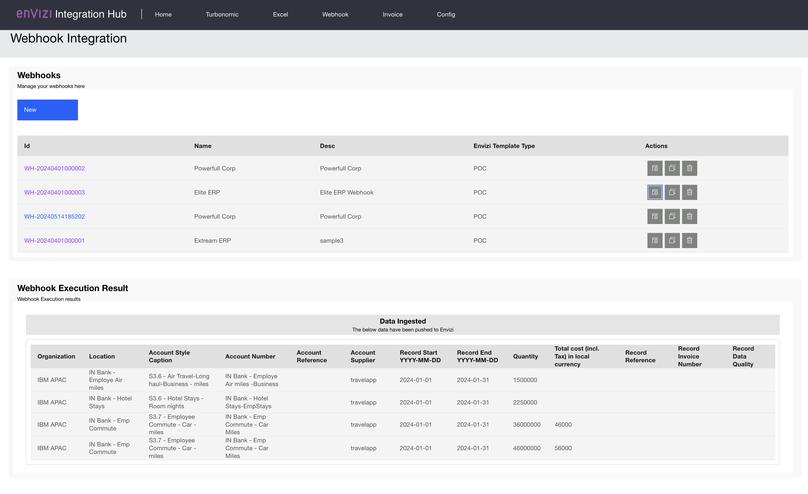

## 3. Webhook Edit

Here is detailed info about a Webhook.

It contains the webhook access details, data mapping, webhook response, preview of Envizi data generated out of the webhook response and mapping.

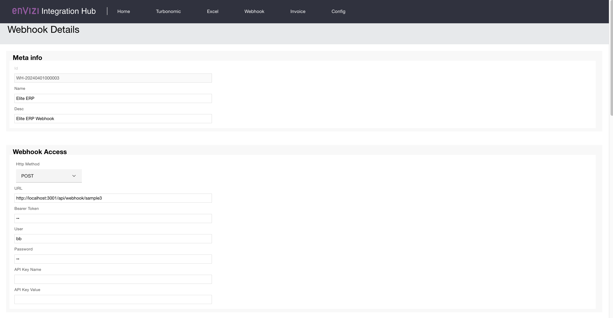
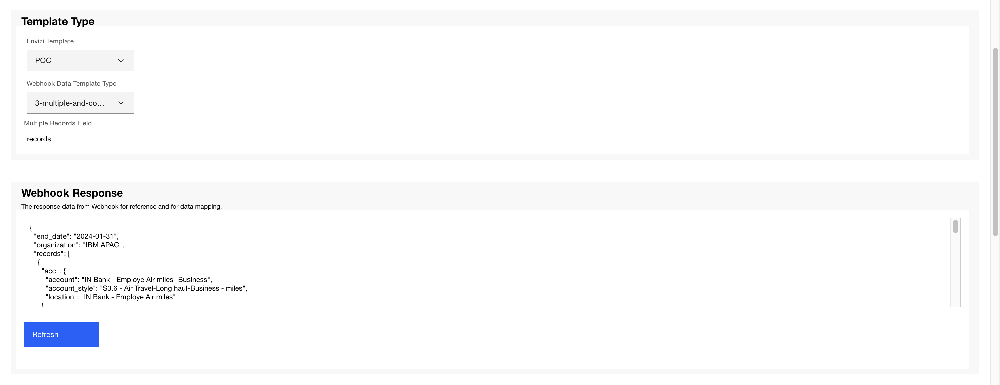
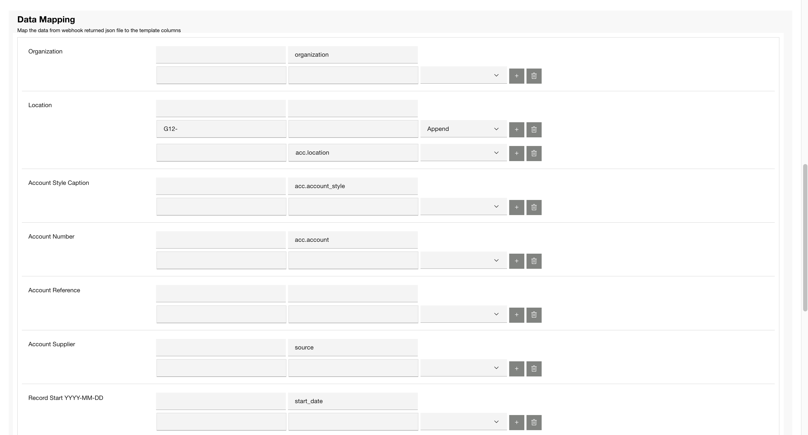
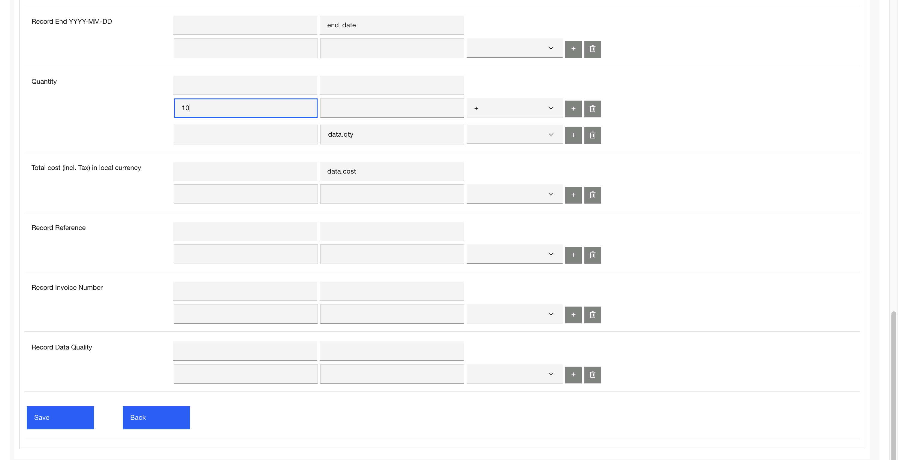
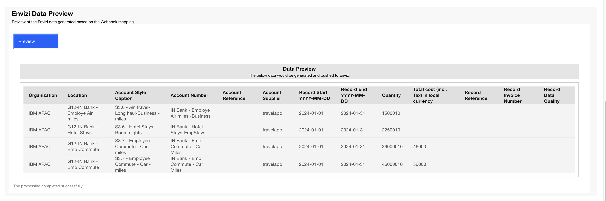
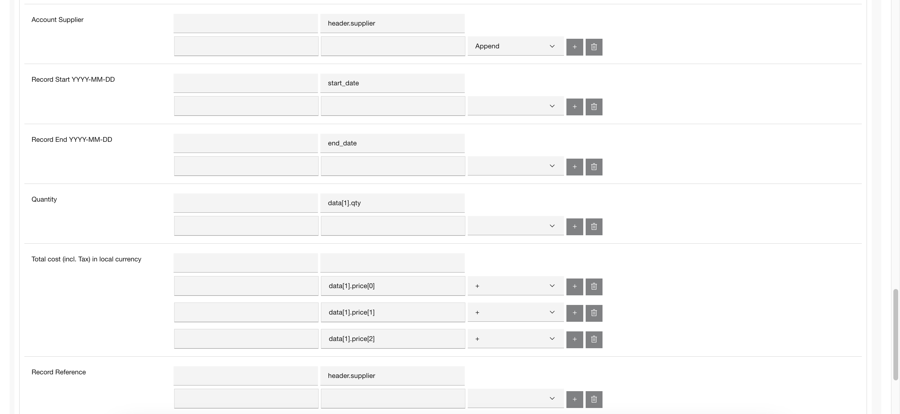
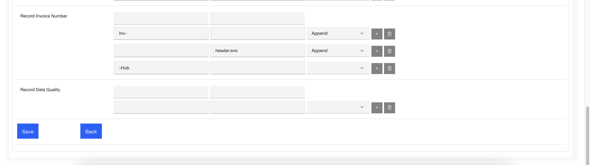

## 4. Mapping

Here is the mapping details explained.

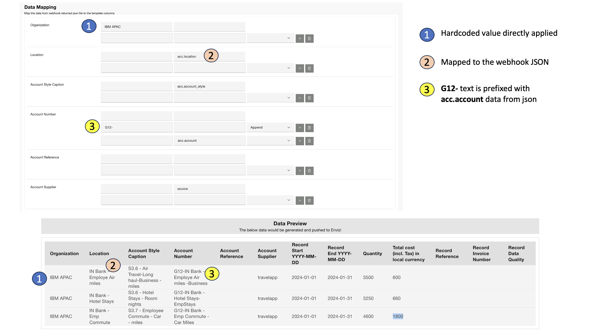
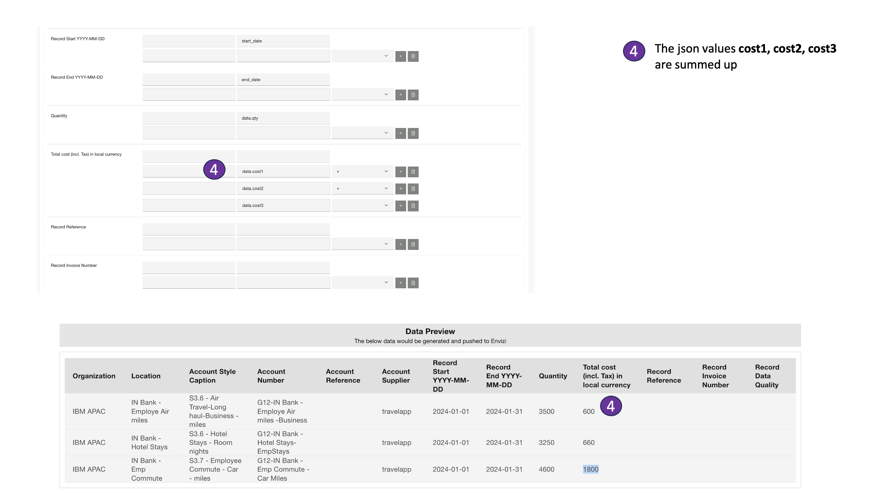
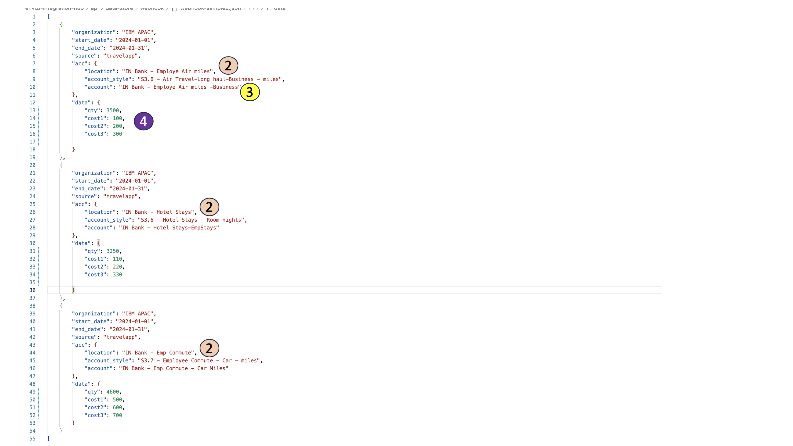

## 5. Webhook Data Types

### 5.1 Type 1

#### Data

#### Mapping

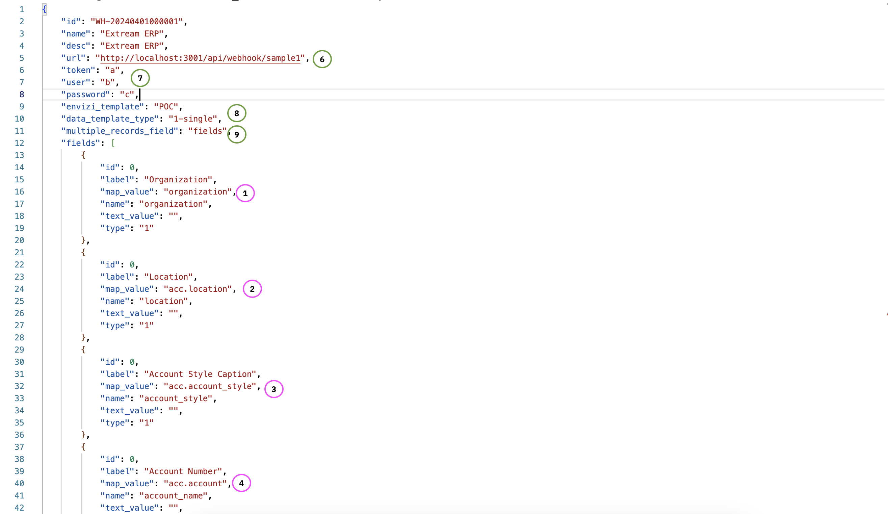

#### Envizi data

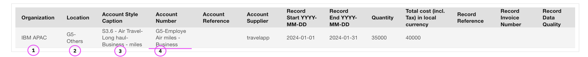

### 5.2 Type 2

#### Data

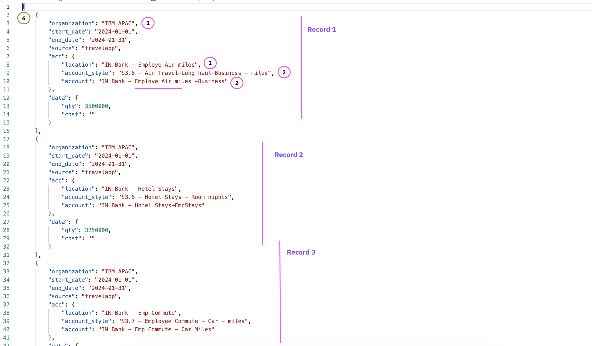

#### Mapping

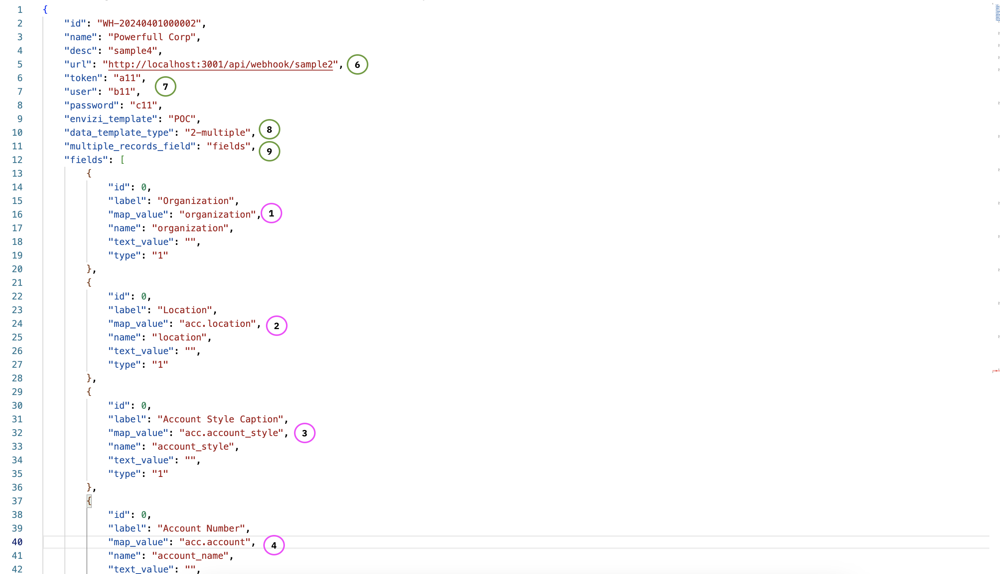

#### Envizi data

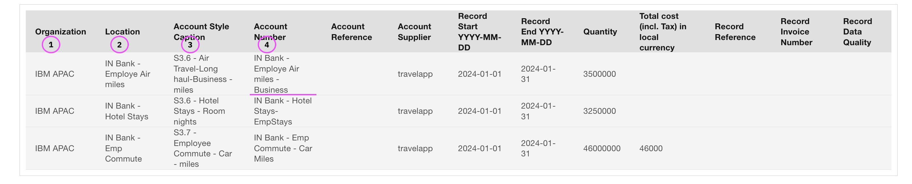

### 5.3 Type 3

#### Data

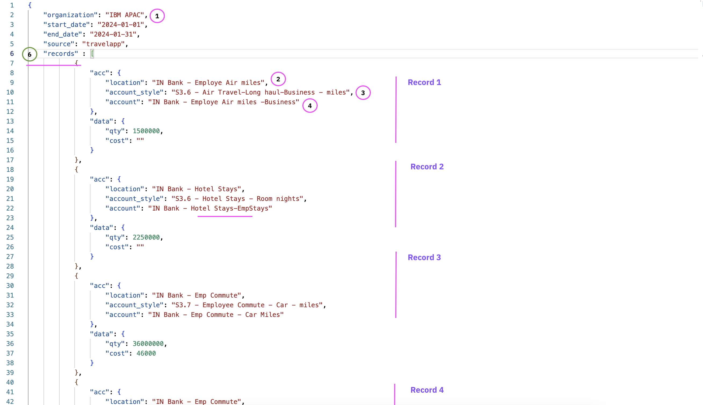

#### Mapping

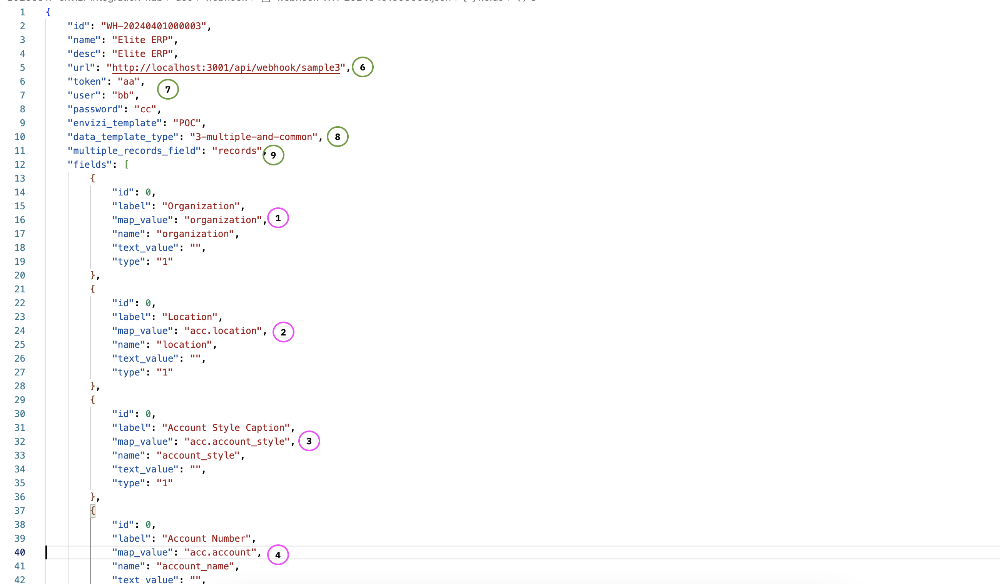

#### Envizi data

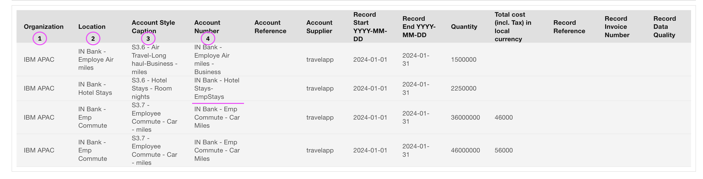

