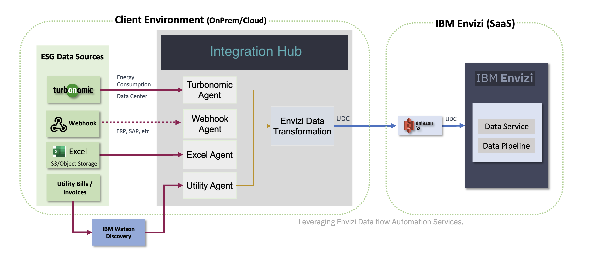
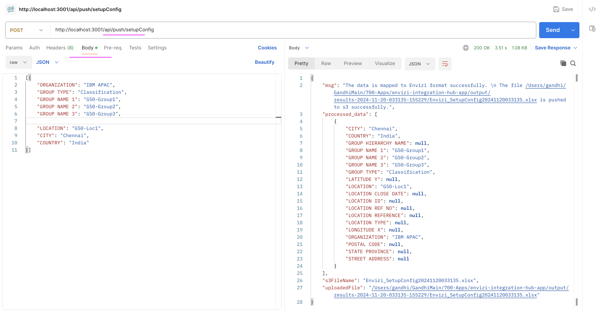
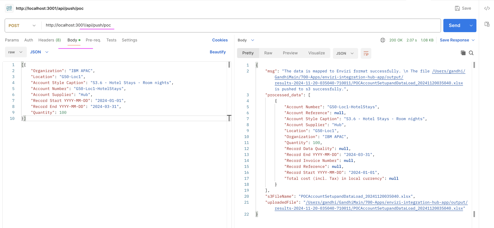
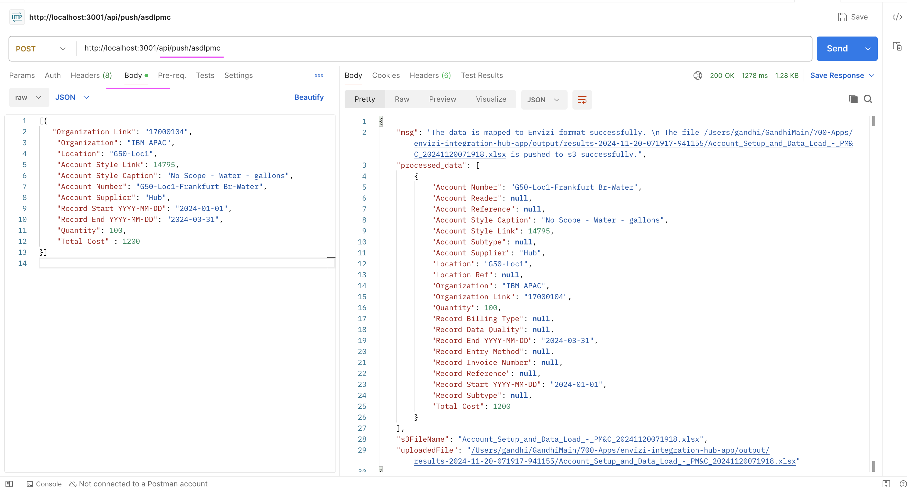

# Envizi Integration Hub - API

Integration Hub exposes API to ingest data into Envizi. Any external systems can call these APIs to push thier ESG data into Envizi via this Integration Hub.

## 1. Architecture

Here is the architecture of the Hub.



## 2. APIs

Here are the 3 APIs available as of now. Here you need to replace `http://localhost:3001` with appropriate url.

http://localhost:3001/api/push/setupConfig

http://localhost:3001/api/push/poc

http://localhost:3001/api/push/asdlpmc


### 2.1 Setup Config

This setup config API is to push the Setup Config template `(Envizi_SetupConfig_xxxx.xlsx)` file data into Envizi.


#### API

Here is the API http://localhost:3001/api/push/setupConfig

You need to replace `http://localhost:3001` with appropriate url.

#### Input Data

- The input file should be a Json data.
- Here is the sample Json Data [file](./files/01-setupconfig-input.json) 

```
[
    {
    "ORGANIZATION": "IBM APAC",
    "GROUP TYPE": "Classification",
    "GROUP NAME 1": "G50-Group1",
    "GROUP NAME 2": "G50-Group2",
    "GROUP NAME 3": "G50-Group3",
    "LOCATION": "G50-Loc1",
    "CITY": "Chennai",
    "COUNTRY": "India"
    }
]
```
- You can also have multiple records like this [file](./files/03-setupconfig-input2.json) 

- The Keys available in the json data is from the envizi template [file](./files/Envizi_SetupConfig_template.xlsx) 


#### Sample Curl script

Here is the sample curl script to call this API.

```
curl --location 'http://localhost:3001/api/push/setupConfig' \
--header 'Content-Type: application/json' \
--data '[{
    "ORGANIZATION": "IBM APAC",
    "GROUP TYPE": "Classification",
    "GROUP NAME 1": "G50-Group1",
    "GROUP NAME 2": "G50-Group2",
    "GROUP NAME 3": "G50-Group3",
    "LOCATION": "G50-Loc1",
    "CITY": "Chennai",
    "COUNTRY": "India"
}]'
```

#### Sample PostMan 

Here is the sample post man screenshot to call this API.




### 2.2 POC

This POC API is to push the POC account setup and data load template `(POCAccountSetupandDataLoad_xxxxx.xlsx)` file data into Envizi.

#### API

Here is the API http://localhost:3001/api/push/poc

You need to replace `http://localhost:3001` with appropriate url.

#### Input Data

- The input file should be a Json data.
- Here is the sample Json Data [file](./files/11-poc-input.json) 

```
[
    {
    "Organization": "IBM APAC",
    "Location": "G50-Loc1",
    "Account Style Caption": "S3.6 - Hotel Stays - Room nights",
    "Account Number": "G50-Loc1-HotelStays",
    "Account Supplier": "Hub",
    "Record Start YYYY-MM-DD": "2024-01-01",
    "Record End YYYY-MM-DD": "2024-03-31",
    "Quantity": 100
    }
]
```
- You can also have multiple records for this. 

- The Keys available in the json data is from the envizi template [file](./files/POCAccountSetupandDataLoad_template.xlsx) 


#### Sample Curl script

Here is the sample curl script to call this API.

```
curl --location 'http://localhost:3001/api/push/poc' \
--header 'Content-Type: application/json' \
--data '[{
    "Organization": "IBM APAC",
    "Location": "G50-Loc1",
    "Account Style Caption": "S3.6 - Hotel Stays - Room nights",
    "Account Number": "G50-Loc1-HotelStays",
    "Account Supplier": "Hub",
    "Record Start YYYY-MM-DD": "2024-01-01",
    "Record End YYYY-MM-DD": "2024-03-31",
    "Quantity": 100
}]'
```

#### Sample PostMan 

Here is the sample post man screenshot to call this API.




### 2.3 ASDL PMC

This ASDL PMC API is to push the Account setup and data load PM&C template `(Account_Setup_and_Data_Load_PM-C_xxxxx.xlsx)` file data into Envizi.

#### API

Here is the API http://localhost:3001/api/push/asdlpmc

You need to replace `http://localhost:3001` with appropriate url.

#### Input Data

- The input file should be a Json data.
- Here is the sample Json Data [file](./files/21-asdl-pmc-input.json) 
```
[
    {
    "Organization Link": "17000104",
     "Organization": "IBM APAC",
     "Location": "G50-Loc1",
     "Account Style Link": 14795,
     "Account Style Caption": "No Scope - Water - gallons",
     "Account Number": "G50-Loc1-Frankfurt Br-Water",
     "Account Supplier": "Hub",
     "Record Start YYYY-MM-DD": "2024-01-01",
     "Record End YYYY-MM-DD": "2024-03-31",
     "Quantity": 100,
     "Total Cost" : 1200
    }
]
```
- You can also have multiple records for this. 

- The Keys available in the json data is from the envizi template [file](./files/Account_Setup_and_Data_Load_PM-C_template.xlsx) 

#### Sample Curl script

Here is the sample curl script to call this API.

```
curl --location 'http://localhost:3001/api/push/asdlpmc' \
--header 'Content-Type: application/json' \
--data '[{
   "Organization Link": "17000104",
    "Organization": "IBM APAC",
    "Location": "G50-Loc1",
    "Account Style Link": 14795,
    "Account Style Caption": "No Scope - Water - gallons",
    "Account Number": "G50-Loc1-Frankfurt Br-Water",
    "Account Supplier": "Hub",
    "Record Start YYYY-MM-DD": "2024-01-01",
    "Record End YYYY-MM-DD": "2024-03-31",
    "Quantity": 100,
    "Total Cost" : 1200
}]
'
```

#### Sample PostMan 

Here is the sample post man screenshot to call this API.



