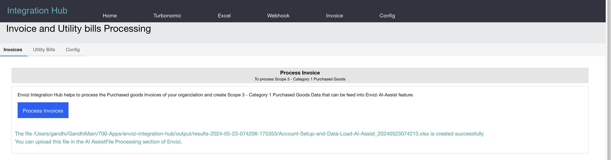
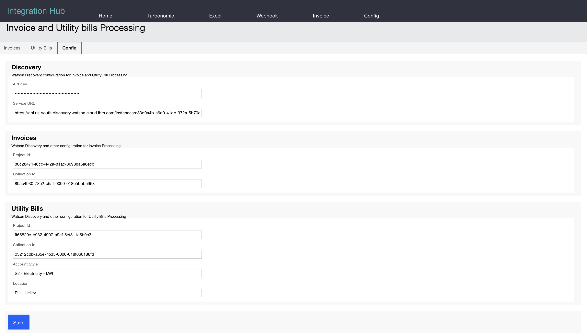

# Envizi Integration Hub - Invoices

The Integration Hub helps to read PDF Invoices using IBM Watson Discovery and create a Envizi Scope-3 Category-1 AI Assist Template files to push the Utility data into Envizi.

## 1. Architecture

The Invoices are stored in IBM Watson Discovery as a collections.

Smart Document Understanding (SDU) trains IBM Watson Discovery to extract custom fields from the Invoices.

The Integration Hub can pull the data from the Watson Discovery and Convert the data into the Envizi format.

## 2. Invoices in Watson Discovery

The Invoices are kept in the Watson Discovery.

Smart Document Understanding helps to extract custom fields from the invoices.

The sample invoices are available here. 
- [Invoice1-94400.pdf](./files/Invoice1-94400.pdf)  
- [Invoice2.pdf](./files/Invoice2.pdf)  
- [Invoice3-UniverComputers.pdf](./files/Invoice3-UniverComputers.pdf)
- [Invoice11-53100.pdf](./files/Invoice11-53100.pdf)  
- [Invoice12-7080.pdf](./files/Invoice12-7080.pdf)  
- [Invoice21.pdf](./files/Invoice21.pdf)  

## 3. Integration of Invoices into Envizi 

This section will communicate with the Watson Discover to pull the data and covert into the Envizi format and Push to S3 bucket configured.

## 4. Configurations

This section show the configuration required for the Watson Discovery.

