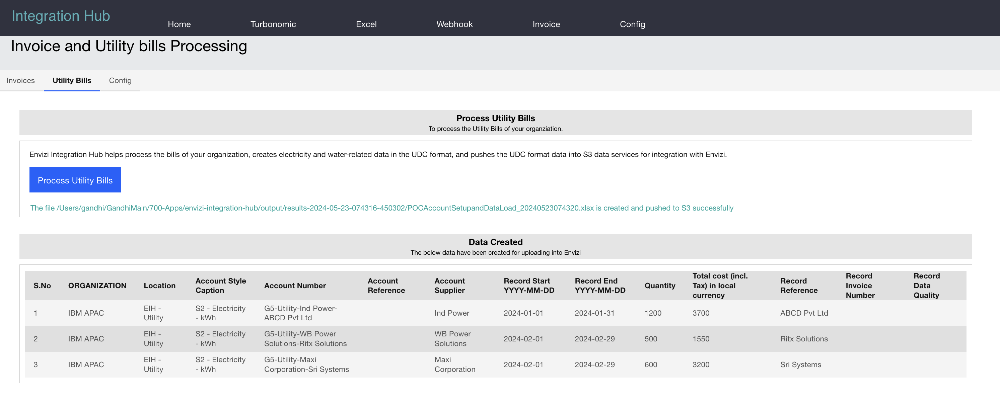

# Envizi Integration Hub - Utility Bills

The Integration Hub helps to read Utillity bills of PDF format using IBM Watson Discovery and create a Envizi UDC template files to push the Utility bills data into Envizi.

## 1. Architecture

The utility bills are stored in IBM Watson Discovery as a collections.

Smart Document Understanding (SDU) trains IBM Watson™ Discovery to extract custom fields from the utility bills.

The Integration Hub can pull the data from the Watson Discovery and Convert the data into the Envizi format.

## 2. Utility Bills in Watson Discovery

The Utlity bills are kept in the Watson Discovery.

Smart Document Understanding helps to extract custom fields from the utility bills.

The sample utility bills are available here.  
- [utilitybills1-Ind.pdf](./files/utilitybills1-Ind.pdf)  
- [utilitybills3-WB.pdf](./files/utilitybills3-WB.pdf) 
- [utilitybills5-maxi.pdf](./files/utilitybills5-maxi.pdf)

## 3. Integration of Utility Bills into Envizi

This section will communicate with the Watson Discover to pull the data and covert into the Envizi format and Push to S3 bucket configured.

## 4. Configurations

This section show the configuration required for the Watson Discovery.

