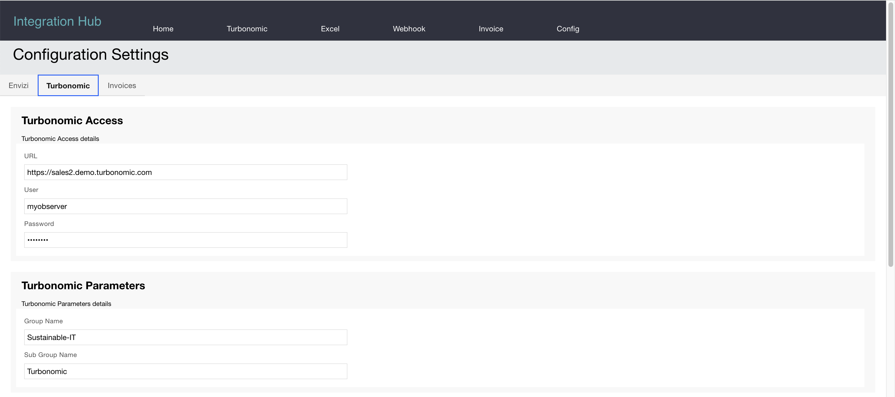

# Envizi Integration Hub - Turbonomic

Integration Hub can able to integrate into IBM Turbonomic to be get the engery consumption of the Data center.

## 1. Turbonomic Data
Here are the various data from Turbonomic pulled into Envizi.

The below images shows the `Groups & Locations` data retrived from Turbonomic and converted in Envizi format.

The below image shows the `Accounts and Data` containing the `Energy Consumption` details.

The below image shows the `Accounts and Data` containing the `Active Hosts` details.

The below image shows the `Accounts and Data` containing the `Active VMs` details.

The below image shows the `Accounts and Data` containing the `Energy Host Intensity` details.

The below image shows the `Accounts and Data` containing the `VM Host Density` details.

## 2. Configuration

Here are the configuration to connect with the Turbonomic.

