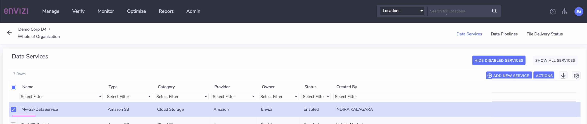
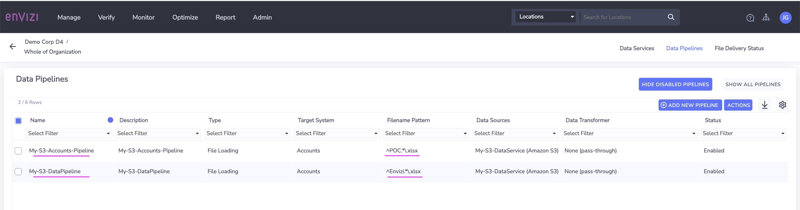

# Envizi Integration Hub - Create Data Service and Data Pipeline in Envizi

Envizi Integration Hub leverages  Envizi Data Service and Envizi Data Pipeline to integrate external systems into in Envizi.

This document explains about how to create Data Service and Data Pipeline in Envizi.

## 1. Create Data Service

You need to create Data Service in Envizi. You can refer the tutorial https://developer.ibm.com/tutorials/awb-sending-udc-excel-to-s3/#step-1-create-a-data-service-for-aws-s3-bucket for the detailed steps.

1. Create Data service in envizi. 


2. Note down the following values for future reference:
Bucket
Folder
Username
Access Key
Secret Access Key

## 2.Create Data Pipeline

You need to create Data Pipeline in Envizi. You can refer the tutorial https://developer.ibm.com/tutorials/awb-sending-udc-excel-to-s3#step-2-create-a-data-pipeline for the detailed steps.

1. Create Data Pipeline in envizi. 


The file name patterns used here are       

```
^POC.*\.xlsx
^Envizi.*\.xlsx
^Account.*\.xlsx
```


