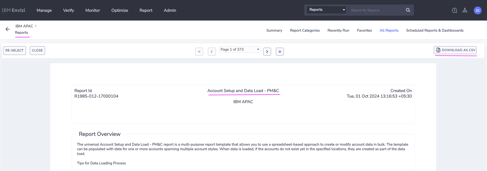
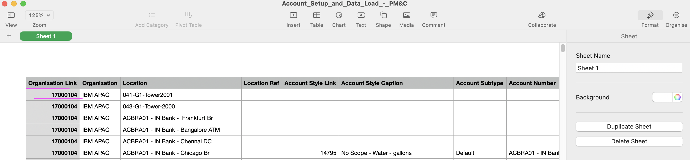

# Envizi Integration Hub - Prepare Configuration file

This document explains about how to prepare Configuration file to use in Envizi Integration Hub.

## 1. Open the Config file

1. Open the config file available in the below location.

  ```
  /Users/xyz/envizi-integration-hub-app/api/config/envizi-config.json
  ```
  
  FYI: This file is available in repo [here](../../../../api/config/envizi-config.json)

## 2. Update Envizi s3 bucket details

Update the below envizi s3 bucket details from the data we noted while creating Data service in envizi.

```
  "envizi": {
    "access": {
      "bucket_name": "envizi-client-dataservice-us-prod",
      "folder_name": "client_9608cd600af647",
      "access_key": "xxxx",
      "secret_key": "xxxxx"
    },
  }
```

  "envizi": {
    "access": {
      "bucket_name": "envizi-client-dataservice-us-prod",
      "folder_name": "client_dedd4566f2f247",
      "access_key": "xxxx",
      "secret_key": "xxxx"
    },
    "parameters": {
      "org_name": "IBM APAC",
      "org_link": 17000104,
      "prefix": "G5"
    }
  },


## 3. Update Envizi OrgName and OrgLink

Lets update the `org_name` and `org_link` in the properties.

```
  "envizi": {
    "parameters": {
      "org_name": "IBM APAC",
      "org_link": 17000104,
    }
  },

```

### Org Name

The `org_name` is your organization name in the org hierarchy as highlighted below in the screenshot.

As per the screenshot, for this Envizi instance, `IBM APAC`is the org name.


### Org Link

The `org_link` is used only when you use `Account Setup and Data Load - PM&C` template in the Integration Hub.

The Org Link can be obtained from the `Account Setup and Data Load - PM&C` report. 

1. Open this `Account Setup and Data Load - PM&C` report. 

2. Click on `DOWNLOAD AS CSV` button



3. Open the downloaded csv file.

You can see the value of the `Organization Link` column.




## 4. Update Envizi Prefix (Optional)

Update `prefix` in `envizi` section. 

This helps the Integration Hub to create groups, locations, and accounts with a specified prefix, helping to avoid duplicates if any already exist.

You can give any value for this. You can use your short name or your team's short name to indicate who created it.

```
  "envizi": {
    "parameters": {
      "prefix": "G5"
    }
  },
```

## 5. Update Turbonomic access

Update the below Turbonomic access details.

The user should have `Observer` role.

```
  "turbo": {
    "access": {
      "url": "https://xxxxx.turbonomic.com",
      "user": "",
      "password": ""
    },
  }

```
## 6. Update Turbonomic parameters (Optional)

Here are the Turbonomic parameters. You may need to modify `account_style_xxxxx` properties as per your environment. Otherwise no updates are required in the parameters. You can see the below explanations about the parameters.

```
  "turbo": {
    "parameters": {
      "group": "Sustainable-IT",
      "sub_group": "Turbonomic",
      "start_date": "2023-10-30",
      "end_date": "2023-11-04"
    },
    }
```

1. The `group` and `sub_group` are created as `Groups` in Organization Hierarchy.
2. Each datacenter from Turbonomic is created as a `Location` under the `sub_group`.


## 7. Update Turbonomic Account Styles (Optional)

You may need to modify `account_style_xxxxx` properties as per your environment. Otherwise no updates are required in the parameters. You can see the below explanations about the parameters.

```
  "turbo": {
    "account_styles" : [
      {
        "name": "energy_consumption",
        "link": 14445,
        "account_name": "Energy Consumption", 
        "caption": "S2 - Electricity - kWh", 
        "columns" : ["Total Electricity (kWh)", "Green Power (kWh)", "Total Cost"],
        "file_prefix" : "Account_Setup_and_Data_Load_engery_"
      },
      {
        "name": "active_hosts",
        "link": 17000021,
        ....
        ....
        ....
      }
    ]
    }
```

Similar to the below  `Accounts` and `Account Styles` to be created for each Datacenter from Turbonomic.
  ```
  Account                         Account Style
  -----------------------         ------------------------
  Energy Consumption      ---     Energy Consumption - kWh
  Active Hosts            ---     Active Hosts [Number]     
  Active VMs              ---     Active Virtual Machines [Number]
  Energy Host Intensity   ---     Energy Host Intensity - kWh/host
  VM Host Density         ---     Virtual Machine to Host Density - VM/Host
  ```

If you have these `Account Styles` in your environment you can update the `account_style_xxxxx` properties with the your values. 