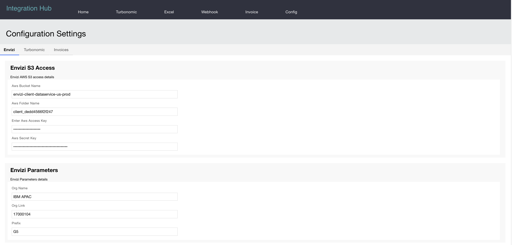

# Envizi Integration Hub - Update Configuration settings in the App

The config file `envizi-config.json` content would be displayed here in app. The properties can be further updated here if required. 

### Envizi Configuration

### Turbonomic Configuration

### Invoice and Utility Bills Configuration

