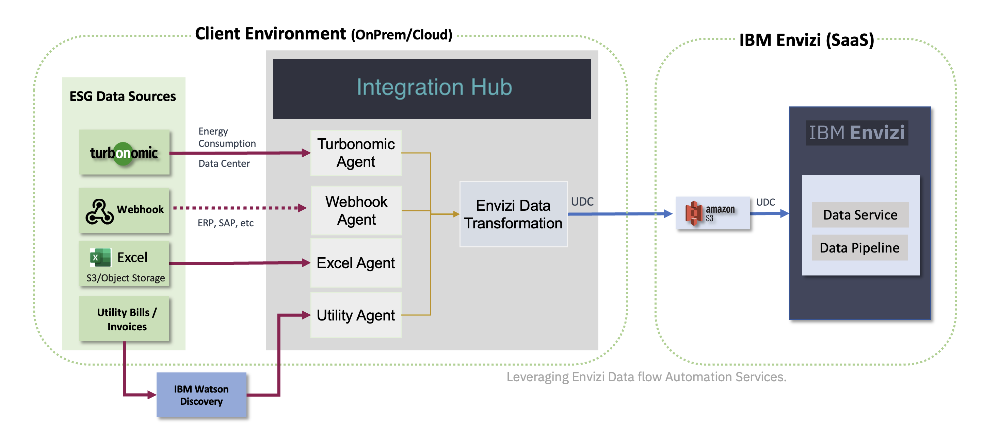

# Starting the App using Docker / Podman

This document explains about how to start Envizi Integration Hub in Docker / Podman.

You need to run the 2 docker images (API app and UI app).

## 1. Start the API App 

Lets start the API App in Linux VM.

1. Keep the configuration file `envizi-config.json` in some folder. Lets us assume the file is located in `/tmp/envizi-config.json`

2. Run the below command to start the app.

The abolve file name is mentioned in the `-v` parameter here and suffixed with `:/app/envizi-config.json`

```
docker run -d -p 3001:3001 --name my-e-int2-hub \
    --env LOGLEVEL=DEBUG \
    --env DATA_FOLDER="/app/data" \
    --env DATA_STORE_FOLDER="/app/data" \
    --env OUTPUT_FOLDER="/app/output" \
    -v "/tmp/envizi-config.json:/app/envizi-config.json" \
    gandigit/e-int-hub2-linux:latest

```

#### Note

- To run the same in `Mac`, you need to change the image `e-int-hub2-linux` into `e-int-hub2-mac` in the above command.

- To run the same using `Podman` instead of `Docker`, you need to change the  `docker` into `podman` in the above command.

3. Open the url `http://##IP_ADDRESS_OF_VM##:3001/hello` in the browser to see if it is working.


## 2. Start the UI App 

Lets start the UI App in Linux VM.

1. Replace the `##IP_ADDRESS_OF_VM##` with the actual IP address of the VM where API App is running.

```
podman run -d -p 3000:3000 --name my-e-int-hub2-ui --env NEXT_PUBLIC_API_URL="http://##IP_ADDRESS_OF_VM##:3001"  gandigit/e-int-hub2-ui-linux:latest
```

2. Run the above command to start the UI app.

#### Note

- To run the same in `Mac`, you need to change the image `e-int-hub2-ui-linux` into `e-int-hub2-ui-mac` in the above command.

- To run the same using `Podman` instead of `Docker`, you need to change the  `docker` into `podman` in the above command.

3. Open the url `http://##IP_ADDRESS_OF_VM##:3000/hello` in the browser to see if it is working.

4. The below home page should have been displayed.



## 3. Stop the App (for info only)

Run the below commands one by one to stop the apps.

```
docker stop my-e-int2-hub
docker rm my-e-int2-hub

docker stop my-e-int2-hub-ui
docker rm my-e-int2-hub-ui
```

## 4. View App logs (for info only)

Run the below commmand to view the logs of the apps.

```
docker logs my-e-int2-hub

docker logs my-e-int2-hub-ui
```