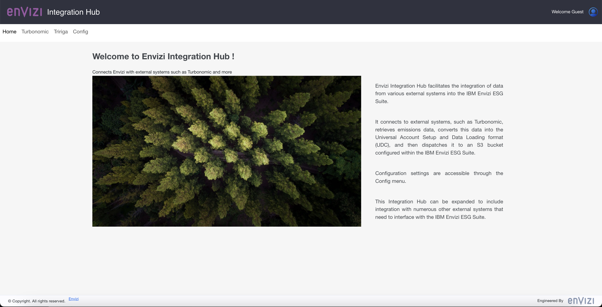

# Envizi Integration Hub - Starting the App using Docker (Under Construction...)

This document explains about how to start Envizi Integration Hub in Docker.

The Integration Hub App should be started with the configuration file.

## 1. Start the App

1. Keep the property file `envizi-config.json` in some folder. Lets us assume the file is located in `/tmp/envizi-config.json`

2. Run the below command to start the app.

The abolve file name is mentioned in the `-v` parameter here and suffixed with `:/app/envizi-config.json`

for Mac
```
docker run -d -p 3001:3001 --name my-e-int-hub -v "/tmp/envizi-config.json:/app/envizi-config.json" gandigit/e-int-hub-mac:latest

```

for linux
```
docker run -d -p 3001:3001 --name my-e-int-hub -v "/tmp/envizi-config.json:/app/envizi-config.json" docker.io/gandigit/e-int-hub-linux:latest
```

3. Open the url http://localhost:3001/ in the browser to see the home page.




## 2. Stop the App (for info only)

Run the below commands one by one to stop the app.

```
docker stop my-e-int-hub
docker rm my-e-int-hub
```

## 3. View the App logs (for info only)

Run the below commmand to view the logs of the app.

```
docker logs my-e-int-hub
```