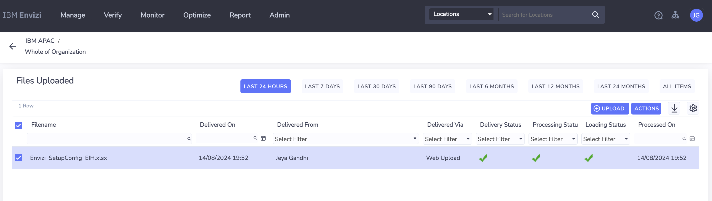
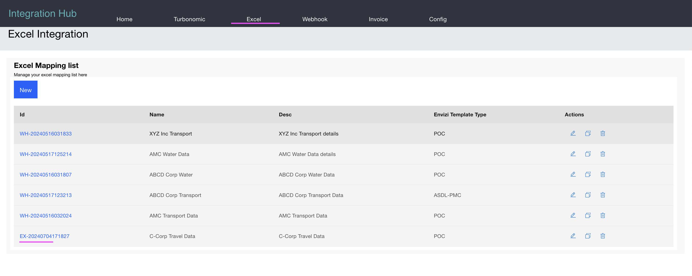
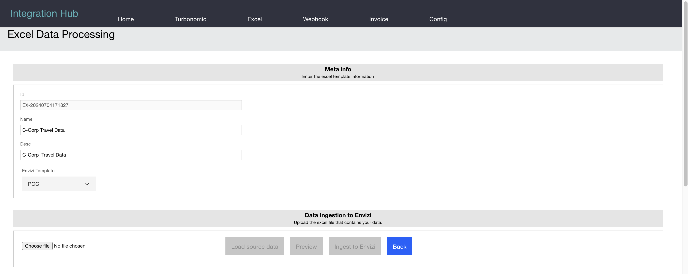
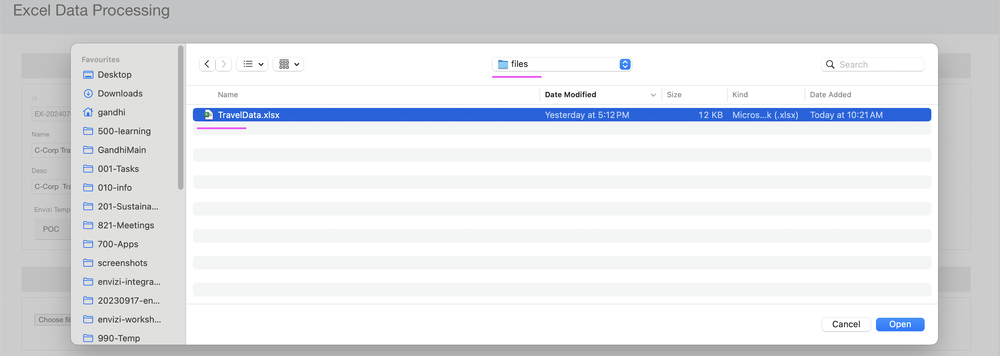

# Demo Script - Excel Data Processing

Here is the demo script for the Excel Integration of the Integration Hub.

## Steps

### Groups and Locations  (one time only)

Before uploading Accounts and Data Excel file, we need to create the Groups and Locations as a Prerequisite.

1. Open the file [Envizi_SetupConfig_EIH.xlsx](./files/Envizi_SetupConfig_EIH.xlsx) available in this repo.

2. Change the value of the `ORGANIZATION` column as per your envizi Instance Organization name.

3. Upload to Envizi.

### Excel Mappings list

1. Click on the menu `Excel`. 

It will show the Excel Mappings list as given below.

2. Click on the `C-Corp Travel Data` link to open the mapping details page.

### Excel Mapping Detail

Here is the mapping details page. If you want, you can change the mapping as per your need here and save.

Here is the detail about the mapping

- **Organization :** This column is hard coded with the `IBM APAC` text.
- **Location :** This column is mapped to the `Places` column of the excel.
- **Account Number :** This column is mapped to the `Subject Name` column of the excel.
- **Total cost (incl. Tax) in local currency :** This column is mapped to the sum of `Cost A` + `Cost B` + `Cost C` columns of the excel.

### Upload Excel

1. Click on the `Choose file` button to upload your excel file.

2. Select the file [TravelData.xlsx](./files/TravelData.xlsx) available in this repo.

The content of the excel file is like this.

### Load Source Data

After loading the Excel file, its columns are added to the dropdown lists of the mapping section. 

1. Click on the `Load Source Data` button to load the excel file columns into the mapping section.

2. The excel file columns are loaded. You can see the columns in the drop down list.

3. You can change the mapping as per your need here and `Save`.

### Preview

1. Click on the `Preview` button to to see how the Excel data is converted in the Envizi POC template format based on the mapping.

The preview data is displayed here.

### Ingest to Envizi

1. Click on the `Ingest to Envizi` button to push the converted Excel data into Envizi.

The data is pushed to Envizi.

### Results

The data integration should have been done and you can able to see the below org hierarchy.

