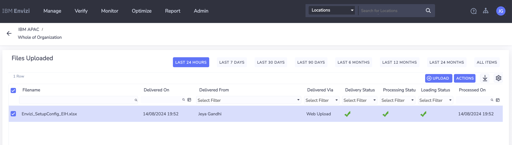
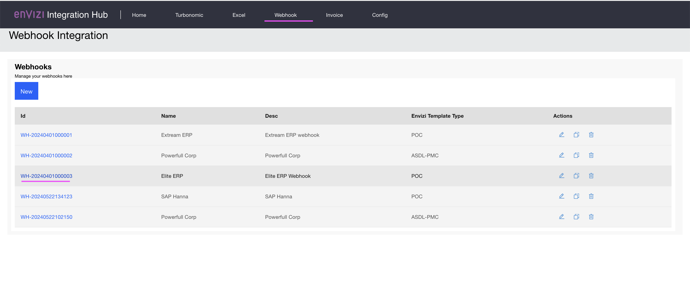
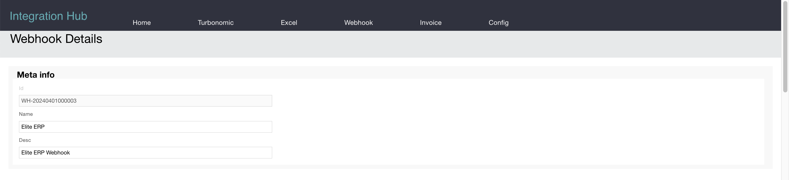
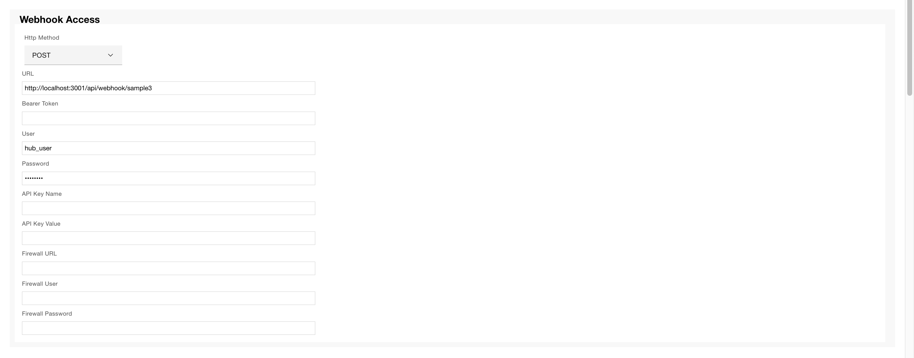
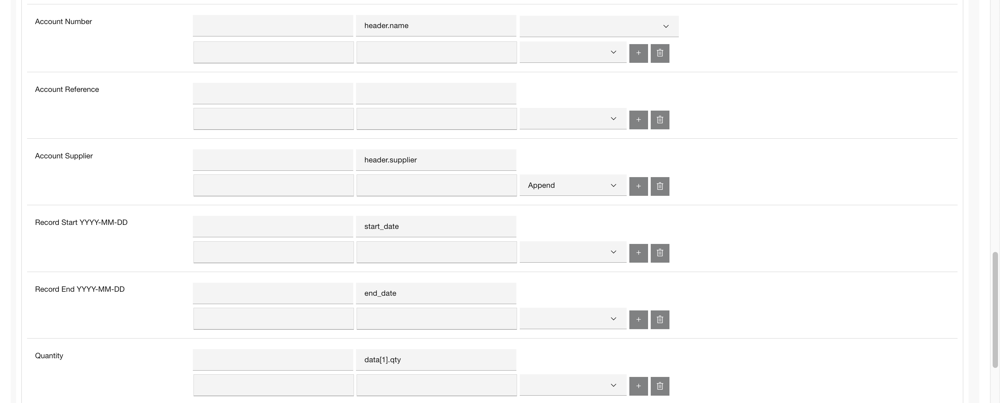
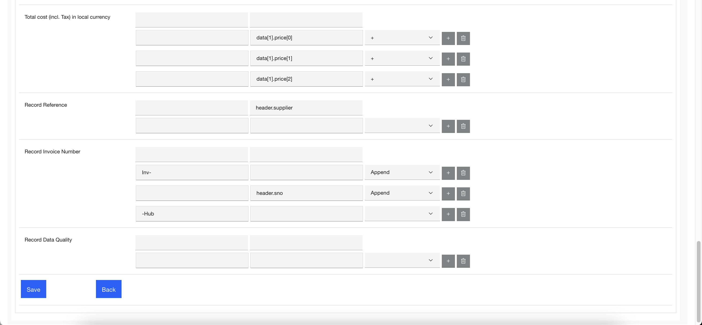
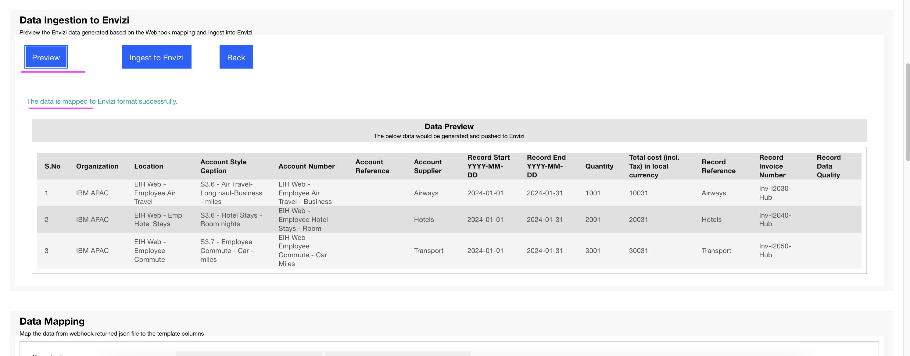
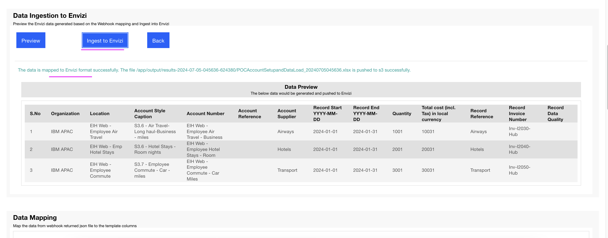
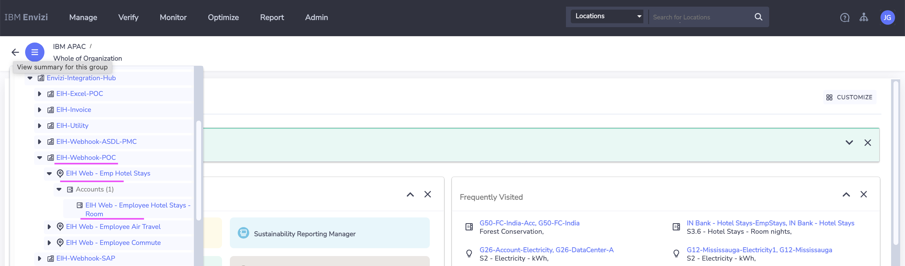

# Demo Script - Wehook Data Processing

Here is the demo script for the Wehook Integration of the Integration Hub.

## Steps

### Groups and Locations (one time only)

Before uploading Accounts and Data via webhook, we need to create the Groups and Locations as a Prerequisite.

1. Open the file [Envizi_SetupConfig_EIH.xlsx](./files/Envizi_SetupConfig_EIH.xlsx) available in this repo.

2. Change the value of the `ORGANIZATION` column as per your envizi Instance Organization name.

3. Upload to Envizi.

### Webhook

1. Click on `Webhook` to open the Webhook Mappings list. 

Here you have all the existing Webhook mappings.

2. Click on the `Elite ERP` link

The mapping details page is displayed.

3. Click on the `Preview` button to how the Webhook data is converted in the Envizi POC template format based in the mapping.

4. Click on the `Ingest to Envizi` button to push the converted Webhook data into Envizi.

### Results

The data integration should have been done and you can able to see the below org hierarchy.

