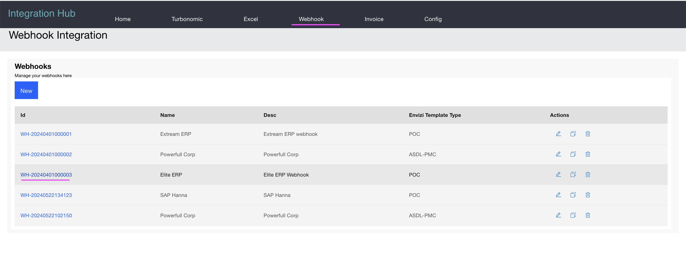

# Demo Script - Wehook Data Processing

Here is the demo script for the Wehook Integration of the Integration Hub.

## Steps

1. Click on `Webhook` to open the Webhook Mappings list. 

Here you have all the existing Webhook mappings.

2. Click on the `Elite ERP` link

The mapping details page is displayed.

3. Click on the `Preview` button to how the Webhook data is converted in the Envizi POC template format based in the mapping.

4. Click on the `Ingest to Envizi` button to push the converted Webhook data into Envizi.

